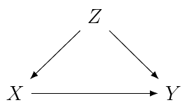

# Let's begin.

---

::: columns

:::: column
### 1
**Interesting.**

Where *do* we go from here?
::::

:::: column
### 2
**Still looking.**
For that blue jean berry queen.
::::

:::

---

## With Text 
Underneath a header you'll occasionally find a lot of
test that you might not normally find elsewhere.

  - sometimes with bullets
  - a-nother bullet

---

And sometimes you just need a task list:

- [ ] This is unchecked.
- [X] This is checked.

## Heres a different test
Sometimes you'll find yourself writing a really long
[paragraph](https://www.google.com/search?q=paragraph) and just for kicks end
up adding a [couple](https://duckduckgo.com) links.

---

::: columns

:::: column
### 3
Here's an interesting one.
::::

:::: column

::::

:::

---

> i have eaten  
> the plums  
> that were in  
> the icebox  
> --- e. e. cummings
---
    
## Code blocks work too

~~~ {.python} 

from functools import reduce
from operator import mul

def factorial(n):
    return reduce(mul, range(2, n+1))
~~~

## Questions?
